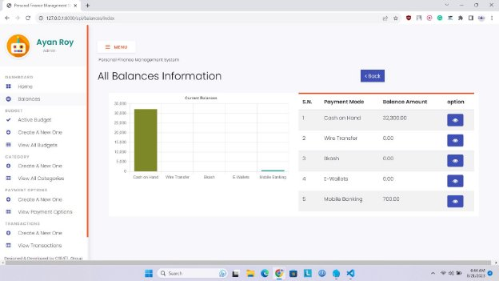

**CSE471 : System Analysis and Design Project Report**

**Project Title : Personal Finance Tracker**

17

**Table of Contents**

|**Section No**|**Content**|**Page No**|
| :-: | - | - |
|1|Introduction|2|
|2|Functional Requirements|2|
|3|User Manual|3|
|4|Frontend Development|13|
|5|Backend Development|14|
|6|Technology (Framework, Languages)|16|
|7|Github Repo Link|17|
|8|Individual Contribution|17|

**Introduction**

The Personal Finance Tracker application aims to provide users with a comprehensive platform for managing their personal finances. The application will allow users to track their income, expenses, and savings goals. It will provide features such as budgeting tools, expense categorization, transaction history, and data visualization to assist users in making informed financial decisions. This document outlines the system requirements for the development and implementation of the Personal Finance Tracker application.

**Functional Requirements**

1. User Management
   1. The system shall authenticate users during the login process.
   1. The system shall provide password reset functionality for users who forget their passwords.
   1. The system shall store and manage user profile information, including personal details and financial goals.
1. Income Tracking
   1. The system shall allow users to add and track multiple sources of income.
   1. The system shall provide options for users to categorize their income (e.g., salary, freelance work, investments).
   1. The system shall calculate and display the total income.
1. Expense Tracking
   1. The system shall allow users to add and track various expenses, including fixed expenses (e.g., rent, utilities) and variable expenses (e.g., groceries, entertainment).
   1. The system shall provide options for users to categorize their expenses for better organization and analysis.
   1. The system shall calculate and display the total expenses.
1. Budget Management
- The system shall allow users to create budgets for different categories (e.g., groceries, transportation, entertainment).
- The system shall provide options for users to set budget limits for each category.
- The system shall display budget progress and show a visual representation when the user exceeds or is close to exceeding the budget limit.
5. Transaction History
   1. The system shall maintain a transaction history for all income and expense entries.
   1. The system shall allow users to view all their transaction history in a glance.
5. Data Visualization
- The system shall present visual representations (charts, graphs) of income, expenses and budgets to help users analyze their financial situation.

**User Manual**

There are five major modules for the user side. They are- dashboard, budget, category, payment options, transactions.

1. **HOMEPAGE**

Users get this page when they first enter this website. It has two parts, a dashboard and balances.

1. **Dashboard**

The dashboard serves as the financial hub, giving one a snapshot of financial status at a glance. Here's what can be found on the dashboard:

Figure: Homepage

- Total Income
- Cash on Hand at the moment.
- Current Balances: A bar chart showcasing your current balances, categorized into "Cash on Hand", "Credit Card" and so on.
- Previous Budgets: A bar chart showing the amount and savings of one’s previous budgets.
2. **Balances**

Balances represent financial accounts, such as bank accounts or credit cards. In the "Balances" section, there are three sections:

Figure: Balances of personal finance management

- View a list of all balances, including their titles and current amounts.
- Access detailed information about each balance.
- Add and update balances to reflect accurate financial data.
2. **BUDGET**

This Budget section has three pages.

1. **Active Budget**

In the first page, we get “Active Budget”-

Figure: Active Budget Here, we get the overview of the currently active budget.

- A pie-chart shows the spending and saving status.
- Another bar chart represents the budget duration and remaining days.
- Also showcases all the detailed information of the budget including titles, allotted amounts, spendings, savings, starting and ending date.
2. **Create A New one**

In the second page, we get “create a new one”-

Figure: Create Budget

- Here, one can create a new budget.
- It will take all the detailed information to create a new budget.
3. **View All Budgets**

In the third page, we get “View All Budgets”-

Figure: View All Budgets

- This section enables one to manage budgets effectively by showcasing all the budgets information in a page.
- One can view a list of all budgets, including their titles, allotted amounts, spendings, savings, starting and ending date.

  .

3. **Category:**

Users can create a category of each type of their income source or their expenses. In the figure , we can see the interface of the category.

It has two pages. **3.1.**Create a new one:

Figure: Create a category

In this page users can create a category of their expenses and income. It will require a title,entry principles and a description of the category.

**3.2.**View all categories:

Figure: View Category

In this page, users can view all of the categories they have made so far. They can edit the categories and also delete them if they want.

4. **PAYMENT**

In this part,users can keep track of their finances. It has two pages.

1. **Create a new one**

In the first page, we get “Create a new one”-

Figure: Create Payment

Here, we have to-

- Give a title of each new payment options
- Also,a short description of that payment has to be given
2. **View Payment Options:**

In the second page,

Figure: View Payment Option

- This section enables one to manage their payments effectively by showcasing all the payment options information in a page.
- One can view a list of all payments , including their titles.Also they can edit the payments and delete the data if needed.
5. **Transaction**

After creating both category and payment options, users can add their transactions into the system. The transaction section lets users do the following action.

Figure: Create Transaction

- Add Transaction: Users can create transactions by adding title, description, amount. Users can pick and choose from the Category and Payment option that they had created previously.
- View Transactions: Users can click on the “View Transactions” on the navigation bar, and it will show them all the transactions that have occurred before. Users can also choose to add a new transaction by clicking the “Add New” button as it will route them to the “Add Transaction” page.

Figure: All Transactions

One information that the users need to know is that transactions cannot be deleted or edited. As they are vital to other sections of the website, they have been stripped of these functionalities for simplicity. So, the users need to be aware while adding transactions.

**Frontend Development**

Frontend Development plays a vital role to create an engaging and functional user interface for this website. We have used a template and mastered it according to our requirements. We created Blade views to render the frontend UI. These views can be located in the “resources/views” directory. Views are used to present data and interact with users.

**Figure: Views**

**Backend Development**

We have followed the MVC pattern to create a Personal Finance Tracker. Developing the backend for it involves setting up the database, creating models and controllers, defining routes, and implementing the business logic to handle various operations related to budgets, transactions, categories and payment options. Firstly, we defined the database structure in the migration files and ran “php artisan migrate” to create the database tables.

1. **Models**

An Eloquent model for each database table was created such as budget, category etc.

**Figure: Models**

2. **Controllers**

Controllers were created for each entity and related functionality. Controllers handle the incoming HTTP requests, execute business logic, and return responses.

**Figure: Controllers**

3. **Routes**

We defined routes in the “routes/web.php” file to map incoming requests to the appropriate controller methods.

**Figure: Routes**

**Technology (Framework, Languages)**

Framework: Laravel, PHP

